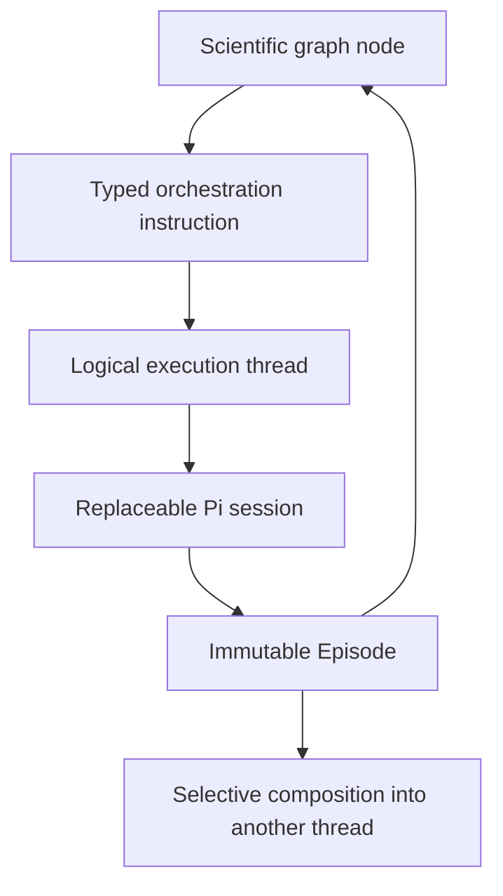

# NOSH typed orchestration runtime

This document describes the operational runtime added beneath NOSH's scientific graphs. The Mission DAG, Research Direction DAG, experiment tree, and claim/evidence graph remain authoritative for scientific outcomes. Execution threads record how bounded work produced and consumed Episodes.

The implementation follows the public ideas in [Slate](https://randomlabs.ai/blog/slate), [Skill Chaining](https://randomlabs.ai/blog/skill-chaining), and [Onyx](https://randomlabs.ai/blog/onyx): bounded thread actions, explicit synchronization values, background fan-out and joins, episode-scoped skills, blocking conversational forks, strict output schemas, named persistent state, bounded program execution, and loud failures. It does not attempt to reproduce undocumented Random Labs internals.

## Runtime contracts

The strict Zod contracts live in `packages/wire/src/runtime.ts` and are exported as JSON Schema plus minimal, full, missing-field, and unknown-field fixtures.

The instruction set is deliberately small:

| Instruction | Deterministic effect |
|---|---|
| `THREAD_OPEN` | Creates a logical workstream and binds its first Pi session. |
| `THREAD_STEP` | Performs one bounded action and requires one typed `episode-draft`. |
| `THREAD_FORK` | Creates a foreground interactive thread and blocks the owning director scope. |
| `THREAD_AWAIT` | Joins with `all`, `first_success`, `minimum_count`, or `deadline`. |
| `THREAD_COMPOSE` | Adds selected immutable Episode references to a target thread. |
| `THREAD_PAUSE` | Steers the current Pi session to a safe boundary and persists paused state. |
| `THREAD_CANCEL` | Aborts the physical session and durably cancels the logical thread. |
| `SKILL_APPLY` | Activates a validated skill for the next Episode or runs its program. |
| `DIRECT_ACTION` | Invokes an injected daemon action only within capability and actor scope. |
| `STOP` | Terminates a thread, a program, or both. |

Every instruction has a Project, immutable instruction ID, idempotency key, proposer, and timestamp. Pi submissions must bind `proposedByAgentId` to the daemon-known physical session. Directors can orchestrate only inside their scientific scope; workers can control their own thread and child threads. Replacement intervention hooks retain the immutable envelope and pass authorization again.

## Threads, sessions, and Episodes

A thread is durable and a Pi session is replaceable. Thread records retain purpose, scientific owner scope, role, parent/children, selected inputs, active skills, capability scope, budgets, usage, Episode IDs, and the complete physical-session history. Rotation starts a new Pi session without copying a transcript.

One `THREAD_STEP` has one terminal Episode boundary. Successful Pi work returns exactly one schema-valid Episode draft in the host-enforced final assistant-text JSON envelope, not an `nosh_episode_submit` tool call. Task-scoped turns also require one terminal outcome. Missing typed output is a failure; prose cannot advance state. A model or transport failure produces a durable failed Episode and then throws. This is not provider-constrained decoding. See [terminal output](protocols/terminal-output.md).

Each Episode retains:

- a full Project event-sequence range for audit and UI inspection;
- a strict immutable record with facts, decisions, evidence/artifact IDs, file changes, unresolved questions, actions, cost, and hash;
- a deterministic compact projection used by later prompts.

Artifact and evidence IDs must already exist in authoritative storage. Repository file paths cannot be absolute or escape the Project root. Hashes are checked when Episodes are read. Parallel cost accounting uses only events emitted by the Episode's bound Pi agent, so unrelated concurrent work is not charged.

The context router passes only explicitly selected Episode projections, capped at 20 and packed into a 16,000-character Episode-projection budget. Recent projections win; older selected Episodes remain addressable by immutable ID. It never injects a parent or worker's full transcript.

## Token and cache discipline

- Full records remain authoritative in SQLite and immutable Episodes. Continuation uses a deterministic generated projection, so agents do not maintain parallel summary or “truth” documents.
- Step prompts put invariant instructions before selected context and the changing objective. Accepted typed-tool calls return a fixed short receipt instead of echoing a potentially large projection.
- Pi sessions use a compact role system prompt. OpenAI requests receive a stable, privacy-preserving cache key derived from Project, role, and tool profile; task, Agent, and request IDs do not perturb it. Completion events record input, output, cache-read, and cache-write tokens so hit rates can be measured rather than inferred.

These choices follow the shared prefix rule documented by [OpenAI](https://developers.openai.com/api/docs/guides/prompt-caching), [Anthropic](https://platform.claude.com/docs/en/build-with-claude/prompt-caching), and [Google](https://ai.google.dev/gemini-api/docs/caching/): place stable content first, keep tool and prompt ordering deterministic, reuse cache affinity, and put volatile content last.

## Skills and programs

A skill manifest declares roles, capability and Episode activation conditions, prompt text, permitted tools, input and output Episode types, execution mode, and deterministic preflight/postflight checks. Skills disappear at the Episode boundary unless explicitly applied again.

Tool permission is preventive and defensive. A skill Episode rotates into a Pi session created with the intersection of every active skill's tool allowlist. The runtime also audits emitted tool events afterward. Multiple skills therefore cannot widen each other's permissions. A skill must permit the `nosh_episode_submit` capability because typed output is mandatory; the scoped Pi session hides that tool and the host authorizes the final-text Episode record against the capability.

An orchestration skill points to a statically compiled program. Programs contain only runtime instructions, named declared state, guarded branches/loops, foreground steps, background spawns, explicit await instructions, failure targets, and hard step/token/tool/wall-clock bounds. State is type-checked and checkpointed after every transition. Agent results may bind only declared state fields.

Program instructions receive deterministic IDs. Operation intents make foreground and spawned actions replayable; duplicate program calls share one execution. On daemon restart, pending instructions and every program left in `running` resume automatically. Before completion the interpreter durably joins every spawned operation, so a process restart cannot silently mark unfinished background work complete. Failures become a durable `failed` state and throw unless the program declares a failure branch.

`STOP` on a program stops the interpreter. It does not imply cancellation of already independent child threads; issue `THREAD_CANCEL` for those threads when cancellation is required.

## Foreground forks

Foreground forks are the interactive skill mode in the backend. Mission and Direction supervisors do not schedule another cycle while a fork in their exact scope is active. A stopped fork cannot be reused. The former PWA takeover and remote controls were removed. The TUI has no foreground-fork takeover or message/Finish commands; use the local typed API for this workflow.

## Causal intervention boundary

Hooks run after schema and actor validation and before dispatch. A hook may execute, suppress, or replace an instruction. NOSH durably records the proposed instruction, eligibility/reasons, assignment, execution status, input/output references, state before/after, immediate Episode outcomes, cost, latency, and downstream Episode IDs. Longer-horizon scientific outcome analysis remains an analytics concern over the event log; it is not guessed at instruction time.

## Daemon and UI integration

Mission, Direction, and Autoresearch worker sessions now pass through `THREAD_OPEN`, `THREAD_STEP`, and `STOP`. Pi also exposes `nosh_runtime_instruct` so an authorized model can choose typed operations directly. `noshd` exposes authenticated routes for instructions, threads, session rotation, foreground messages, Episodes/traces, skills, programs, program states, and program execution. The TUI provides bounded status and event views, not a Threads graph or foreground-fork controls. There are no encrypted remote snapshots or remote devices.

## Phase completion and adversarial disposition

| Phase | Implemented proof |
|---|---|
| A | Parallel open/step/all-await, strict Episode output, compact projection, and exact trace/cost tests. |
| B | Repeated steps, selective composition, restart recovery, logical continuity, and physical session rotation. |
| C | Backend foreground fork state, director blocking, cancellation, and no reuse after STOP. Former PWA and remote UI controls are removed, not validated in the TUI. |
| D | Durable manifests, episode-scoped activation, preventive tool allowlists, capability/input/output checks, and deterministic gates. |
| E | Static compilation, typed persistent state, guards/loops/branches/joins, durable spawns, budgets, checkpoints, failure state, STOP, deduplication, and restart resume. |
| F | Execute/suppress/replace boundary with immutable authorization and durable causal records. |

The table lists automated test scope, not a release acceptance claim. Authenticated providers, crashes at every instruction boundary, Windows/WSL2/GPU workloads, terminal accessibility, and security review require separate evidence. Current gates are listed in `docs/testing/release-gates.md`; removed browser and relay features are not release gates.
